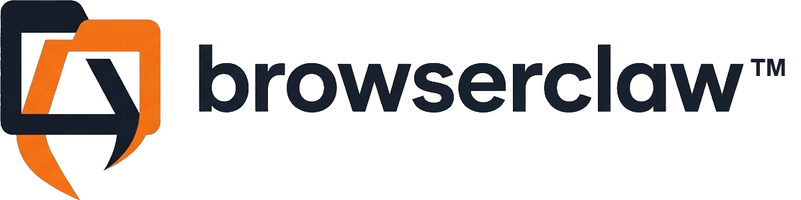

<p align="center">
  
</p>

<p align="center">
  <a href="https://browserclaw.org"></a>
  <a href="https://www.npmjs.com/package/browserclaw"></a>
  <a href="./LICENSE"></a>
  <a href="https://www.npmjs.com/package/browserclaw"></a>
  <a href="https://github.com/idan-rubin/browserclaw/stargazers"></a>
</p>

**The browser tool, not the agent. You bring the brain.**

The AI-native browser automation library — born from [OpenClaw](https://github.com/openclaw/openclaw), built on [Playwright](https://playwright.dev), embeddable in any TS/Node agent loop. **Snapshot + ref targeting**: no CSS selectors, no XPath, no vision model — just numbered refs that map to interactive elements.

Most other tools in this space ship a complete AI agent: they take your task, own the LLM loop, decide what to click, and click it. Great — until you already _have_ an agent. Then you've got two brains fighting over who's in charge.

browserclaw is just the eyes and hands. Call `snapshot()` and get an AI-readable text tree where every interactive element carries a numbered ref (`e1`, `e2`, …). The model reads text — the thing it's best at — and hands back a ref ID. browserclaw resolves that ref to one exact element through a Playwright locator and acts. Same page state → same ref → same result: deterministic targeting, no coordinate guessing, no LLM re-interpreting which element it meant. The reasoning stays in _your_ code.

```typescript
import { BrowserClaw } from 'browserclaw';

const browser = await BrowserClaw.launch({ url: 'https://demo.playwright.dev/todomvc' });
const page = await browser.currentPage();

// Snapshot — the core feature
const { snapshot, refs } = await page.snapshot();
// snapshot: AI-readable text tree
// refs: { "e1": { role: "textbox", name: "What needs to be done?" }, "e2": { role: "link", name: "Playwright" } }

await page.type('e1', 'Buy groceries', { submit: true }); // Type by ref
await page.click('e2'); // Click by ref
await browser.stop();
```

### Bring your own agent loop — or use ours

browserclaw never calls an LLM or decides anything; you do. The whole integration is snapshot in, ref out, act — here it is wired to a real model:

```typescript
import { BrowserClaw } from 'browserclaw';
import Anthropic from '@anthropic-ai/sdk';

const llm = new Anthropic();
const browser = await BrowserClaw.launch({ url: 'https://news.ycombinator.com' });
const page = await browser.currentPage();

for (let step = 0; step < 20; step++) {
  const { snapshot } = await page.snapshot();
  const res = await llm.messages.create({
    model: 'claude-opus-4-8',
    max_tokens: 1024,
    system: 'You drive a browser. Reply with JSON: { "action": "click" | "type" | "done", "ref"?, "text"? }.',
    messages: [{ role: 'user', content: `Task: open the top story.\n\n${snapshot}` }],
  });
  const block = res.content[0];
  const action = JSON.parse(block.type === 'text' ? block.text : '{}');
  if (action.action === 'done') break;
  if (action.action === 'type') await page.type(action.ref, action.text);
  if (action.action === 'click') await page.click(action.ref);
}
await browser.stop();
```

Swap Anthropic for any model — the snapshot is plain text in, a ref is plain text out. **Layered, not bundled:** the LLM, this library, and the agent are three independent pieces. Don't want to write the loop? Use [browserclaw-agent](https://github.com/idan-rubin/browserclaw-agent) — the open-source driver that adds obstacle recovery and learns a reusable skill per site. Bring your own brain, or use ours.

## Why browserclaw?

Most browser automation was built for humans writing test scripts; the rest are full agents that own the loop. An agent you've already built needs neither:

- **Deterministic** — refs resolve to exact elements via Playwright locators (`aria-ref` or `getByRole()`), one ref → one element. No coordinate guessing, no LLM re-interpreting targets between calls.
- **Cheap & fast** — a text snapshot is a fraction of the tokens of a screenshot, and there's no vision API round-trip in the targeting loop.
- **Reliable** — built on Playwright's auto-wait and locator engine, not homegrown DOM poking.
- **Yours to compose** — no framework opinions, no agent loop, no hosted platform. Drop it into whatever architecture you already have.

## How browserclaw compares

There's no single "best" tool here — it depends on whether you're _building_ an agent or _embedding_ a browser tool into one you already own. Here's an honest map (competitor details last verified June 2026).

|                                                    | [browserclaw](https://github.com/idan-rubin/browserclaw) | [browser-use](https://github.com/browser-use/browser-use) | [Stagehand](https://github.com/browserbase/stagehand) | [Playwright MCP](https://github.com/microsoft/playwright-mcp) |
| :------------------------------------------------- | :------------------------------------------------------: | :-------------------------------------------------------: | :---------------------------------------------------: | :-----------------------------------------------------------: |
| Ref → exact element, no guessing                   |                    :white_check_mark:                    |                    :heavy_minus_sign:                     |                          :x:                          |                      :white_check_mark:                       |
| No vision model in the loop                        |                    :white_check_mark:                    |                    :heavy_minus_sign:                     |                  :white_check_mark:                   |                      :white_check_mark:                       |
| Survives redesigns (semantic, not pixel)           |                    :white_check_mark:                    |                    :heavy_minus_sign:                     |                  :white_check_mark:                   |                      :white_check_mark:                       |
| Interact with cross-origin iframes                 |                    :white_check_mark:                    |                    :white_check_mark:                     |                          :x:                          |                              :x:                              |
| Playwright engine (auto-wait, locators)            |                    :white_check_mark:                    |                            :x:                            |                  :white_check_mark:                   |                      :white_check_mark:                       |
| Embeddable in your own JS/TS agent loop            |                    :white_check_mark:                    |                            :x:                            |                  :heavy_minus_sign:                   |                              :x:                              |
| Batteries-included agent (give it a task, it runs) |                           :x:                            |                    :white_check_mark:                     |                  :heavy_minus_sign:                   |                              :x:                              |
| Hosted / managed browser infrastructure            |                           :x:                            |                    :white_check_mark:                     |                  :white_check_mark:                   |                              :x:                              |

:white_check_mark: = Yes&ensp; :heavy_minus_sign: = Partial&ensp; :x: = No

> **If you already own your agent loop, browserclaw is the only one of these you can embed without inheriting someone else's agent.** browser-use and Stagehand shine when you want a batteries-included agent; Playwright MCP is the move when your agent speaks MCP. browserclaw is for when the brain is already yours and you just need reliable, deterministic eyes and hands.

browserclaw is deliberately _not_ a complete agent, ships no hosted infrastructure, and is JS/TS only. If your stack is Python or you want a managed cloud browser, browser-use is the more natural fit — that's the trade: you give up batteries-included convenience to keep full control of the loop.

### How each tool works under the hood

- **browserclaw** — Accessibility snapshot with numbered refs → Playwright locator (`aria-ref` in default mode, `getByRole()` in role mode). One ref, one element. No vision model, no LLM in the targeting loop. You bring the brain.
- **browser-use** — An AI agent framework: takes a task, calls an LLM, decides actions, and executes them over raw CDP (it dropped Playwright for its own index-based engine in 2025). The agent loop is the marketed path, so it's hard to compose into a platform that already owns that loop. The open-source library is Python; an official TypeScript SDK drives its hosted cloud API.
- **Stagehand** — Accessibility tree + natural language primitives (`page.act("click login")`). Convenient, but the LLM re-interprets which element to target on every single call — non-deterministic by design.
- **Playwright MCP** — Same snapshot philosophy as browserclaw, but locked to the MCP protocol. Great for chat-based agents, but not embeddable as a library — you can't compose it into your own agent loop or call it from application code.

## Try It Live — Or On Your Machine

[browserclaw.org](https://browserclaw.org) is an open-source playground — type a prompt and watch an AI agent drive a real browser with browserclaw, live. No setup, no API keys, just a text box and a browser stream. It runs on this library in production, and browserclaw stays current by syncing with the upstream [OpenClaw](https://github.com/openclaw/openclaw) browser SDK.

Want to run it yourself? The source is at [github.com/idan-rubin/browserclaw-agent](https://github.com/idan-rubin/browserclaw-agent) — spin it up with Docker or Node.js. Supports Groq, Gemini, OpenAI, and Anthropic out of the box.

## Install

```bash
npm install browserclaw
```

Requires a Chromium-based browser installed on the system (Chrome, Brave, Edge, or Chromium). browserclaw auto-detects your installed browser — no need to install Playwright browsers separately.

## How It Works

```
┌─────────────┐     snapshot()     ┌──────────────────────────────────────────┐
│  Web Page   │ ──────────────►    │  AI-readable text tree                   │
│             │                    │                                          │
│  [buttons]  │                    │  - heading "todos"                       │
│  [links]    │                    │  - textbox "What needs to be done?" [e1] │
│  [inputs]   │                    │  - link "Playwright" [e2]                │
└─────────────┘                    └──────────────┬───────────────────────────┘
                                                  │
                                          AI reads snapshot,
                                          decides: type in e1
                                                  │
┌─────────────┐   type('e1',...)   ┌──────────────▼──────────────────┐
│  Web Page   │ ◄──────────────    │  Ref "e1" resolves to a         │
│  (updated)  │                    │  Playwright locator — one ref,  │
│             │                    │  one exact element              │
└─────────────┘                    └─────────────────────────────────┘
```

1. **Snapshot** a page → get an AI-readable text tree with numbered refs (`e1`, `e2`, `e3`...)
2. **AI reads** the snapshot text and picks a ref to act on
3. **Actions target refs** → browserclaw resolves each ref to a Playwright locator and executes the action

> **Note:** Refs are scoped to the snapshot that created them. After navigation or DOM changes, old refs become invalid — actions will fail with an error (timeout in aria mode, `"Unknown ref"` in role mode). Always re-snapshot before acting on a changed page.

## API

### Launch & Connect

```typescript
// Launch a new Chrome instance (auto-detects Chrome/Brave/Edge/Chromium)
const browser = await BrowserClaw.launch({
  url: 'https://demo.playwright.dev/todomvc', // navigate initial tab (no extra tabs)
  headless: false, // default: false (visible window)
  executablePath: '...', // optional: specific browser path
  cdpPort: 9222, // default: 9222
  noSandbox: false, // default: false (set true for Docker/CI)
  ignoreHTTPSErrors: false, // default: false (set true for expired local dev certs)
  userDataDir: '...', // optional: custom user data directory
  profileName: 'browserclaw', // profile name in Chrome title bar
  profileColor: '#FF4500', // profile accent color (hex)
  chromeArgs: ['--start-maximized'], // additional Chrome flags
  isolated: true, // fresh per-run profile, auto-cleaned on stop()
  stealth: false, // default: false — inject JS patches (navigator.webdriver, plugins, WebGL vendor, …)
  ciDefaults: false, // default: false — adds CI-deterministic Chrome flags (may fingerprint as automation)
  recordVideo: { dir: './videos' }, // optional: record every page; videos flushed on page/context close
});

// Connect to an already-running Chrome instance
const browser = await BrowserClaw.connect('http://localhost:9222');

// Connect to an auth-protected CDP endpoint (e.g. an OpenClaw gateway)
const browser = await BrowserClaw.connect('http://host:9222', { authToken: '…', stealth: true });

// Auto-discovery: scans common CDP ports (9222-9226, 9229)
const browser = await BrowserClaw.connect();
```

`connect()` checks that Chrome is reachable, then the internal CDP connection retries 3 times with increasing timeouts (5 s, 7 s, 9 s) — safe for Docker/CI where Chrome starts slowly.

**Anti-detection:** `launch()` always passes Chrome the flag that disables the `AutomationControlled` Blink feature.
`connect()` attaches to an already-running Chrome, so it cannot add launch flags retroactively. To inject JavaScript
stealth patches for `navigator.webdriver`, plugins, WebGL vendor, and related browser signals, pass `stealth: true` to
`launch()` or `connect()`.

#### Anti-bot / challenge detection

Detect — and optionally wait out — Cloudflare and CAPTCHA interstitials, so your agent can react instead of acting on a challenge page.

```typescript
const challenge = await page.detectChallenge();
// null, or { kind, message }. kind ∈ 'cloudflare-js' | 'cloudflare-block' | 'cloudflare-turnstile'
//                                  | 'hcaptcha' | 'recaptcha' | 'blocked' | 'rate-limited'

if (challenge?.kind === 'cloudflare-js') {
  const { resolved } = await page.waitForChallenge({ timeoutMs: 20000 }); // pollMs default 500
  if (!resolved) throw new Error('challenge did not clear');
}
```

`waitForChallenge()` polls until the page clears or the timeout elapses. JS challenges usually auto-resolve in a few seconds. The library's job is **detection** — CAPTCHAs (hCaptcha / reCAPTCHA / Turnstile) don't clear on their own. Pair detection with your own solver, a human in a visible window, or [browserclaw-agent](https://github.com/idan-rubin/browserclaw-agent), whose built-in skills clear press-and-hold and Turnstile challenges via CDP.

#### Isolated profiles (per-run, per-process)

Pass `isolated: true` (or `isolated: 'some-label'`) to launch in a dedicated per-run profile under `$TMPDIR/browserclaw/isolated/`:

- A run-scoped random suffix is **always** appended — including when you pass a label string. Two concurrent launches with the same label (`isolated: 'my-run'`) each get a unique directory and never collide on Chrome's SingletonLock. The label is for identification only; it does not produce a stable profile across runs.
- `stop()` removes the isolated user-data directory on exit (best-effort; silent on failure). If the process crashes before `stop()`, leftover directories remain under `$TMPDIR/browserclaw/isolated/` and can be deleted safely when no Chrome process is using them.
- When `isolated` is set, `profileName` and `userDataDir` options are ignored.
- Any cookies, logins, extensions, or localStorage from prior runs are not available — by design.

For a stable, shared profile across runs (persistent login state, preserved history), omit `isolated` and use `profileName` / `userDataDir` instead.

#### SSRF policy (navigating agent-supplied URLs)

**Secure by default.** browserclaw blocks navigation to private and loopback addresses — `127.0.0.1`, `10.0.0.0/8` and the rest of RFC 1918, link-local, the RFC 2544 range, IPv6 ULA, and cloud metadata endpoints like `169.254.169.254`. Public addresses resolve normally; internal ones are refused. Because an agent's target URLs often come from untrusted sources (LLM output, user input, an external API), blocking internal targets is the right default — and DNS is resolved and pinned up front, so a hostname can't pass the check as a public IP and then be fetched as a private one.

To reach private or loopback hosts on purpose (local development, a dev tunnel, an internal dashboard), opt out explicitly:

```typescript
const browser = await BrowserClaw.launch({
  ssrfPolicy: {
    dangerouslyAllowPrivateNetwork: true, // allow loopback, RFC1918, link-local, metadata endpoints
    allowRfc2544BenchmarkRange: true, // optional: also un-block 198.18.0.0/15 (proxy/fake-IP nets)
    allowIpv6UniqueLocalRange: true, // optional: also un-block fc00::/7 (trusted ULA proxy stacks)
  },
});

// Or keep the secure default and carve out only what you need:
const browser2 = await BrowserClaw.launch({
  ssrfPolicy: {
    allowedHostnames: ['internal.myapp.com'], // exempt one named host from the private-IP block
    hostnameAllowlist: ['*.example.com'], // restrict navigation to matching hostnames only
  },
});
```

### Pages & Tabs

```typescript
const page = await browser.open('https://demo.playwright.dev/todomvc');
const current = await browser.currentPage(); // get first usable (non-blank) tab
const tabs = await browser.tabs(); // list all tabs
const handle = browser.page(tabs[0].targetId); // wrap existing tab
const appPage = await browser.waitForTab({ urlContains: 'app-web' });
await browser.focus(tabId); // bring tab to front
await browser.close(tabId); // close a tab
await browser.stop(); // stop browser + cleanup

page.id; // CDP target ID (use with focus/close/page)
await page.url(); // current page URL
await page.title(); // current page title
browser.url; // CDP endpoint URL
```

#### Recovering tab handles

Tab handles can get out of sync if the app rewrites its URL aggressively or replaces the top-level target. Use the recovery primitives to re-bind a `CrawlPage` without having to restart the session:

```typescript
// Attempts to refresh the cached targetId, optionally falling back to the
// best-effort resolver if the original target is gone.
await page.refreshTargetId();
await page.refreshTargetId({ fallback: 'active' });

// Rebind the handle using the best-effort resolver: prefers the old
// targetId, then the old URL, then a non-blank tab, then any tab.
await page.reacquire();
```

> **Contract — heuristic by design:** These resolvers do not query Chrome's focused tab; CDP doesn't expose that cleanly over connect-over-CDP. They apply a fixed preference order — old targetId → old URL → first non-blank accessible tab → any accessible tab — and that order is the contract. Use them for recovery after a target has been lost; don't use them to "ask which tab the human is looking at." When you need deterministic tab selection, capture the `targetId` up front via `browser.open()` / `browser.waitForTab()` / `browser.tabs()` and keep using that handle.

BrowserClaw exports structured errors so workflow code can tell apart the common failure modes:

```typescript
import {
  BrowserTabNotFoundError, // targetId no longer resolves to an open tab
  BlockedBrowserTargetError, // target unavailable after SSRF policy blocked its navigation
  StaleRefError, // ref is not in the current snapshot
  SnapshotHydrationError, // snapshot returned without interactive refs
  NavigationRaceError, // the page navigated during an operation
} from 'browserclaw';

try {
  await page.click('e7');
} catch (err) {
  if (err instanceof StaleRefError) {
    await page.snapshot({ waitForHydration: true });
    // retry with a fresh ref
  } else throw err;
}
```

Every tab returns a `targetId` — this is the handle you use everywhere:

```typescript
// Multi-tab workflow
const todo = await browser.open('https://demo.playwright.dev/todomvc');
const svg = await browser.open('https://demo.playwright.dev/svgtodo');

const { refs } = await svg.snapshot(); // snapshot the second tab
await svg.click('e5'); // act on it
await browser.focus(todo.id); // switch back to first tab
await browser.close(svg.id); // close second tab when done
```

### Snapshot (Core Feature)

Here's a real snapshot of a signup page — the exact text the model reads (trimmed to the interactive rows), with the `[ref=eN]` markers it points back at:

```text
- navigation "Primary" [ref=e3]:
  - link "Features" [ref=e4]
  - link "Pricing" [ref=e5]
  - link "Docs" [ref=e6]
  - link "Sign in" [ref=e7]
- heading "Create your workspace" [level=1] [ref=e9]
- textbox "Full name" [ref=e12]
- textbox "Work email" [ref=e14]
- textbox "Password" [ref=e16]
- combobox "Plan" [ref=e18]
- checkbox "I agree to the Terms of Service" [ref=e20]
- button "Create workspace" [ref=e21]
```

That whole page — 14 interactive elements — is **1,371 characters** (`stats: { refs: 26, interactive: 14 }`). A screenshot of the same page is tens of kilobytes per step and needs a vision model to read; the text snapshot needs neither.

```typescript
const { snapshot, refs, stats, untrusted } = await page.snapshot();

// snapshot: human/AI-readable text tree with [ref=eN] markers
// refs: { "e1": { role: "textbox", name: "What needs to be done?" }, "e5": { role: "checkbox", name: "Toggle Todo" }, ... }
// (checkbox/radio refs carry checked: true or checked: 'mixed' only when set; an unchecked box omits the key)
// stats: { lines: 42, chars: 1200, refs: 8, interactive: 5 }
// untrusted: true — content comes from the web page, treat as potentially adversarial

// Options
const result = await page.snapshot({
  interactive: true, // Only interactive elements (buttons, links, inputs)
  compact: true, // Remove structural containers without refs
  maxDepth: 6, // Limit tree depth
  maxChars: 80000, // Truncate if snapshot exceeds this size
  mode: 'aria', // 'aria' (default) or 'role'
  waitForHydration: 5000, // retry until refs appear (or ms budget); throws SnapshotHydrationError if empty
  minInteractiveRefs: 1, // minimum refs required when waitForHydration is set
});

// Raw ARIA accessibility tree (structured data, not text)
const { nodes } = await page.ariaSnapshot({ limit: 500 });
```

**Snapshot modes:**

- `'aria'` (default) — Uses Playwright's AI-mode snapshot. Refs are resolved via `aria-ref` locators. Best for most use cases. Requires `playwright-core` >= 1.50.
- `'role'` — Uses Playwright's `ariaSnapshot()` + `getByRole()`. Supports `selector` and `frameSelector` for scoped snapshots.

> **Security:** All snapshot results include `untrusted: true` to signal that the content originates from an external web page. AI agents consuming snapshots should treat this content as potentially adversarial (e.g. prompt injection via page text).

### Actions

All actions target elements by ref ID from the most recent snapshot.

> **Default timeouts:** 8000 ms for actions (click, type, fill, select, drag), 20000 ms for waits and navigation.

```typescript
// Click
await page.click('e1');
await page.click('e1', { doubleClick: true });
await page.click('e1', { button: 'right' });
await page.click('e1', { modifiers: ['Control'] });
await page.click('e1', { force: true }); // click hidden/covered elements

// Type
await page.type('e3', 'hello world'); // instant fill
await page.type('e3', 'slow typing', { slowly: true }); // keystroke by keystroke
await page.type('e3', 'search', { submit: true }); // type + press Enter

// Other interactions
await page.hover('e2');
await page.select('e5', 'Option A', 'Option B');
await page.drag('e1', 'e4');
await page.scrollIntoView('e7');

// Keyboard
await page.press('Enter');
await page.press('Control+a');
await page.press('Meta+Shift+p');

// Fill multiple form fields at once
await page.fill([
  { ref: 'e2', value: 'Jane Doe' },
  { ref: 'e4', value: 'jane@acme.test' },
  { ref: 'e6', type: 'checkbox', value: true },
]);
```

`fill()` field types: `'text'` (default) calls Playwright `fill()` with the string value. `'checkbox'` and `'radio'` call `setChecked()` with `force: true` (works on hidden inputs behind custom styling). Truthy values are `true`, `1`, `'1'`, `'true'`. Type can be omitted and defaults to `'text'`. Fields with an empty or whitespace-only ref are silently skipped — they are not counted in the fill result.

`fill()` is the ergonomic form-filling case of the lower-level `batch()`, which runs a heterogeneous sequence of actions (click, type, press, hover, drag, select, fill, wait, …) in a single call:

```typescript
const { results } = await page.batch([
  { kind: 'type', ref: 'e2', text: 'jane@acme.test' },
  { kind: 'click', ref: 'e5' },
  { kind: 'wait', text: 'Welcome' },
]); // stops on first failure by default; pass { stopOnError: false } to keep going
// results: [{ ok: true }, { ok: true }, { ok: true } | { ok: false, error }]
```

#### No-snapshot actions

These methods find and click elements without needing a snapshot first — useful when you know the text or role but don't want the snapshot+ref round-trip.

```typescript
// Click by visible text or title attribute
await page.clickByText('Submit');
await page.clickByText('Save Changes', { exact: true });

// Click by ARIA role and accessible name
await page.clickByRole('button', 'Save');
await page.clickByRole('link', 'Settings');
await page.clickByRole('button', 'Create', { index: 1 }); // second match

// Click by CSS selector
await page.clickBySelector('#submit-btn');

// Click at page coordinates (for canvas elements, custom widgets)
await page.mouseClick(400, 300);

// Press and hold at coordinates (raw CDP events, bypasses automation detection)
await page.pressAndHold(400, 300, { holdMs: 5000, delay: 150 });
```

#### Highlight

```typescript
await page.highlight('e1'); // Playwright built-in highlight
```

#### File Upload

Upload paths are confined to a sandboxed directory: `$TMPDIR/browserclaw/uploads` (e.g. `/tmp/browserclaw/uploads` on Linux). Files must exist inside this directory before uploading — paths outside it are rejected. Stage the file first, then reference it by path:

```typescript
import { DEFAULT_UPLOAD_DIR } from 'browserclaw';
import { copyFile, mkdir } from 'node:fs/promises';
import { join } from 'node:path';

// Stage the file inside the sandboxed uploads directory
await mkdir(DEFAULT_UPLOAD_DIR, { recursive: true });
const staged = join(DEFAULT_UPLOAD_DIR, 'file.pdf');
await copyFile('/path/to/file.pdf', staged);

// Direct: set files on an <input type="file">
await page.uploadFile('e3', [staged]);

// Arm pattern: for non-input file pickers
// Awaiting the call resolves once the listener is armed; awaiting `done`
// resolves after files have been set on the chooser.
const { done } = await page.armFileUpload([staged]);
await page.click('e3'); // triggers the file chooser
await done;
```

#### Dialog Handling

Handle JavaScript dialogs (alert, confirm, prompt). Arm the handler _before_ the action that triggers the dialog.

```typescript
await page.armDialog({ accept: true }); // arm BEFORE the trigger; resolves once the handler is armed
await page.click('e5'); // triggers confirm() — handled in the background

// With prompt text
await page.armDialog({ accept: true, promptText: 'my answer' }); // arm before the trigger
await page.click('e6'); // triggers prompt()

// Persistent handler: called for every dialog until cleared
await page.onDialog((event) => {
  console.log(`${event.type}: ${event.message}`);
  event.accept(); // or event.dismiss()
});
await page.onDialog(undefined); // clear the handler
```

By default, unexpected dialogs are auto-dismissed to prevent `ProtocolError` crashes.

### Navigation & Waiting

```typescript
await page.goto('https://demo.playwright.dev/todomvc');
await page.reload(); // reload the current page
await page.goBack(); // navigate back in history
await page.goForward(); // navigate forward in history
await page.waitFor({ loadState: 'networkidle' });
await page.waitFor({ text: 'Welcome' });
await page.waitFor({ textGone: 'Loading...' });
await page.waitFor({ url: '**/dashboard' });
await page.waitFor({ selector: '.loaded' }); // wait for CSS selector
await page.waitFor({ fn: '() => document.readyState === "complete"' }); // custom JS (string)
await page.waitFor({ fn: () => document.title === 'Done' }); // custom JS (function)
await page.waitFor({ fn: (name) => document.querySelector('button')?.textContent === name, arg: 'Save' }); // with arg
await page.waitFor({ timeMs: 1000 }); // sleep
await page.waitFor({ text: 'Ready', timeoutMs: 5000 }); // custom timeout
```

### Capture

```typescript
// Screenshots
const screenshot = await page.screenshot(); // viewport PNG → Buffer
const fullPage = await page.screenshot({ fullPage: true }); // full scrollable page
const element = await page.screenshot({ ref: 'e1' }); // specific element by ref
const bySelector = await page.screenshot({ element: '.hero' }); // by CSS selector
const jpeg = await page.screenshot({ type: 'jpeg' }); // JPEG format
const noTimeout = await page.screenshot({ timeoutMs: 0 }); // disable the default 30s screenshot timeout

// PDF
const pdf = await page.pdf(); // PDF export (headless only)

// Labeled screenshot — numbered badges on each ref for visual debugging
const { buffer, labels, skipped } = await page.screenshotWithLabels(['e1', 'e2', 'e3']);
// buffer: PNG with numbered overlays
// labels: [{ ref: 'e1', index: 1, box: { x, y, width, height } }, ...]
// skipped: refs that couldn't be found or had no bounding box
```

Both `screenshot()` and `pdf()` return a `Buffer`. Write to file with `fs.writeFileSync('out.png', screenshot)`.

#### Trace Recording

Capture Playwright traces (screenshots, DOM snapshots, network) for debugging.

```typescript
await page.traceStart({ screenshots: true, snapshots: true, sources: true }); // sources defaults to false
// ... perform actions ...
await page.traceStop('trace.zip');
// Open with: npx playwright show-trace trace.zip
```

#### Response Body

Intercept a network response and read its body.

```typescript
const resp = await page.responseBody('/api/data');
console.log(resp.status, resp.body);
// { url, status, headers, body, truncated }
```

Options: `timeoutMs` (default 30 s), `maxChars` (truncate body).

#### Wait For Request

Wait for a network request matching a URL pattern and get full request + response details, including POST body.

```typescript
const reqPromise = page.waitForRequest('/api/submit', { method: 'POST' });
await page.click('e5'); // submit a form
const req = await reqPromise;
console.log(req.method, req.postData); // 'POST', '{"name":"Jane"}'
console.log(req.status, req.ok); // 200, true
console.log(req.responseBody); // '{"id":123}'
// { url, method, postData?, status, ok, responseBody?, truncated? }
```

Options: `method` (filter by HTTP method), `timeoutMs` (default 30 s), `maxChars` (truncate response body).

### Activity Monitoring

Console messages, errors, and network requests are buffered automatically.

```typescript
const logs = await page.consoleLogs(); // all messages
const errors = await page.consoleLogs({ level: 'error' }); // errors only
const recent = await page.consoleLogs({ clear: true }); // read and clear buffer
const pageErrors = await page.pageErrors(); // uncaught exceptions
const requests = await page.networkRequests({ filter: '/api' }); // filter by URL
const fresh = await page.networkRequests({ clear: true }); // read and clear buffer
```

### Storage

```typescript
// Cookies
const cookies = await page.cookies();
await page.setCookie({ name: 'token', value: 'abc', url: 'https://demo.playwright.dev' });
await page.clearCookies();

// localStorage / sessionStorage
const values = await page.storageGet('local');
const token = await page.storageGet('local', 'authToken');
await page.storageSet('local', 'key', 'value');
await page.storageClear('session');
```

### Downloads

```typescript
// Click a download link and save the file
const result = await page.download('e7', '/tmp/report.pdf');
console.log(result.suggestedFilename); // 'report.pdf'
// Returns: { url, suggestedFilename, path }

// Arm pattern: wait for next download (call before triggering)
const dlPromise = page.waitForDownload({ path: '/tmp/file.pdf' });
await page.click('e8'); // triggers download
const dl = await dlPromise;
```

### Emulation

```typescript
// Device emulation (viewport + user agent)
await page.setDevice('iPhone 13');

// Color scheme
await page.emulateMedia({ colorScheme: 'dark' });

// Geolocation
await page.setGeolocation({ latitude: 48.8566, longitude: 2.3522 }); // Paris
await page.setGeolocation({
  latitude: 48.8566,
  longitude: 2.3522,
  accuracy: 50,
  origin: 'https://demo.playwright.dev',
}); // grant to a specific origin
await page.setGeolocation({ clear: true }); // reset

// Locale & timezone
await page.setLocale('fr-FR');
await page.setTimezone('Europe/Paris');

// Network
await page.setOffline(true);
await page.setExtraHeaders({ 'X-Custom': 'value' });
await page.setHttpCredentials({ username: 'admin', password: 'secret' });
await page.setHttpCredentials({ clear: true }); // remove
```

### Evaluate

Run JavaScript directly in the browser page context.

```typescript
const title = await page.evaluate('() => document.title');
const text = await page.evaluate('(el) => el.textContent', { ref: 'e1' });
const count = await page.evaluate('() => document.querySelectorAll("img").length');
const slow = await page.evaluate('() => document.readyState', { timeoutMs: 5000 }); // bounded (default 20s); pass an AbortSignal to cancel
```

#### `evaluateInAllFrames(fn)`

Run JavaScript in ALL frames on the page, including cross-origin iframes. Playwright bypasses the same-origin policy via CDP, making this essential for interacting with embedded payment forms (Stripe, etc.).

```typescript
const results = await page.evaluateInAllFrames(`() => {
  const el = document.querySelector('input[name="cardnumber"]');
  return el ? 'found' : null;
}`);
// Returns: [{ frameUrl: '...', frameName: '...', result: 'found' }, ...]
```

### Viewport

```typescript
await page.resize(1280, 720);
```

### Escape hatch: raw Playwright

When you need something browserclaw doesn't wrap, drop down to Playwright directly — same underlying page, full API (custom locators, `route()` interception, frame manipulation).

```typescript
const pwPage = await page.playwrightPage(); // the raw Playwright Page
await pwPage.route('**/api/**', (r) => r.fulfill({ body: '{}' }));

const loc = await page.locator('.modal button.confirm'); // a Playwright Locator, no Page round-trip
await loc.click();
```

> **Note:** mutations made through the raw Playwright page can conflict with browserclaw's internal ref tracking — re-snapshot after using it.

### Session health: auth checks & telemetry

Built for cron / unattended runs: assert a session is logged in, and read structured timing + exit telemetry for diagnostics.

```typescript
// All rules must pass. Rule kinds: url, cookie, selector, text, textGone, fn.
const auth = await page.isAuthenticated([{ url: '/dashboard' }, { textGone: 'Sign in' }]);
if (!auth.authenticated)
  console.log(
    'failed checks:',
    auth.checks.filter((c) => !c.passed),
  );

browser.recordAuthResult(auth.authenticated);
await browser.stop(auth.authenticated ? 'success' : 'auth_failed'); // exitReason recorded in telemetry

console.log(browser.telemetry());
// { launchMs, connectMs, navMs, authOk, exitReason, cleanupOk, timestamps: { startedAt, … } }
```

`stop()` accepts an `ExitReason`: `'success' | 'auth_failed' | 'nav_failed' | 'timeout' | 'crash' | 'disconnected' | 'manual' | 'error'`.

## Examples

See the [`examples/`](./examples) directory for runnable demos:

- **[basic.ts](./examples/basic.ts)** — Navigate, snapshot, click a ref
- **[form-fill.ts](./examples/form-fill.ts)** — Fill a multi-field form using refs
- **[ai-agent.ts](./examples/ai-agent.ts)** — AI agent loop pattern with Claude/GPT

Run from the source tree:

```bash
npx tsx examples/basic.ts
```

## Requirements

- **Node.js** >= 18
- **Chromium-based browser** installed (Chrome, Brave, Edge, or Chromium)
- **playwright-core** >= 1.50 (installed automatically as a dependency)

No need to install Playwright browsers — browserclaw uses your system's existing Chrome installation via CDP.

## Contributing

Contributions welcome! Please:

1. Fork the repository
2. Create a feature branch (`git checkout -b my-feature`)
3. Make your changes
4. Run `npm run typecheck && npm run build` to verify
5. Submit a pull request

## Acknowledgments

browserclaw was born from the browser automation module in [OpenClaw](https://github.com/openclaw/openclaw), built by [Peter Steinberger](https://github.com/steipete) and an [amazing community of contributors](https://github.com/openclaw/openclaw?tab=readme-ov-file#community). The snapshot + ref system, CDP connection management, and Playwright integration originate from that project.

## License

[MIT](./LICENSE)

---

_Not affiliated with browserclaw.com in any way — no connection to that site; we recommend treating it with caution._
